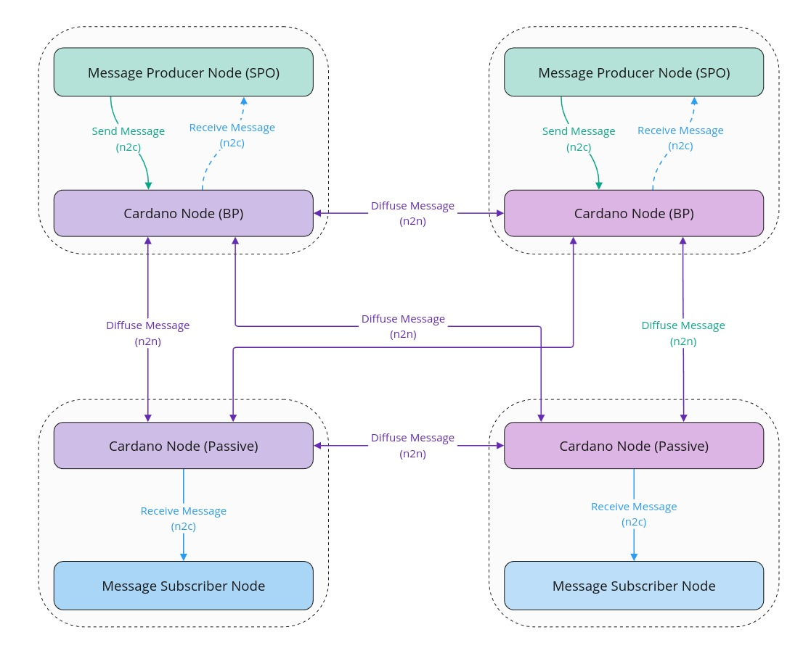
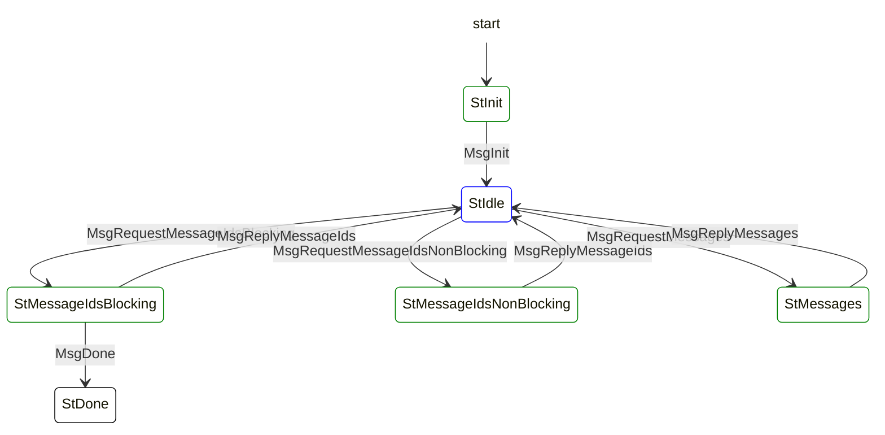
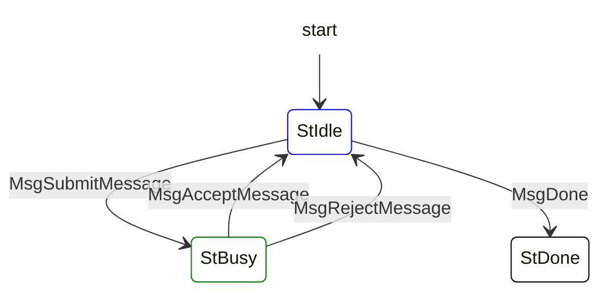
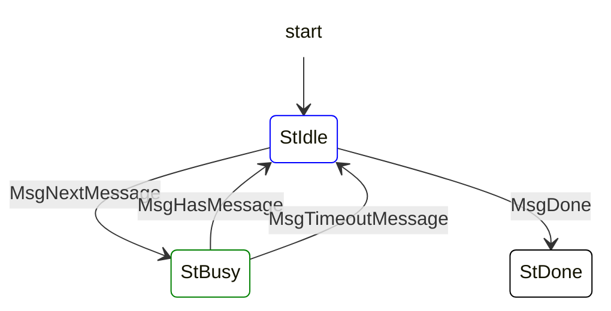

---
CIP: ?
Title: Cardano Decentralized Message Queue
Category: Cardano, Network, Mithril, Leios, Peras
Status: Proposed
Authors:
    - Mithril Team <mithril@iohk.io>
    - Cardano Networking Team <>
Implementors: []
Discussions:
    - https://github.com/cardano-foundation/CIPs/pull/?
Created: 2024-06-14
License: Apache-2.0
---

# Cardano Decentralized Message Queue

## Questions


> [!CAUTION]
> Questions:
> - How can we describe the topic based system (where the first topic is for Mithril, and later instantiations would be e.g. for Peras and Leios)?

## Abstract

We propose to create a decentralized message diffusion protocol leveraging the Cardano network layer. This protocol allows to follow a topic based publish-subscribe pattern to diffuse messages from publisher nodes to subscriber nodes in a decentralized way.  

The messages can be sent and received by nodes running in a non intrusive way side by side to the Cardano node in order to enable inter-nodes communications.

In this way, we can significantly reduce the cost and effort required to build a decentralised network for message diffusion by using Cardano's established infrastructure, with limited impact on the performance and no impact on the security of the Cardano network.

# Motivation

Mithril is a protocol based on a [Stake-based Threshold Multi-signature scheme](https://iohk.io/en/research/library/papers/mithril-stake-based-threshold-multisignatures/) which leverages the Cardano SPOs to certify data from the Cardano chain in a trustless way. Mithril is currently used in the Cardano ecosystem in order to enable fast bootstrapping of full nodes and enabling secure light wallets.

The Mithril protocol coordinates the collection of individual signatures originating from the signers (run by SPOs) by the aggregators which combine them into Mithril multi-signatures and certificates. In order to be fully decentralized, the protocol needs to rely on a decentralized peer to peer network which, if built from the ground up, would require significant efforts and investment. Furthermore, the majority of SPO's, as the representatives of Cardano's active stake, will have to adopt and operate Mithril nodes alongside their Cardano node. Thus a natural solution is to use the Cardano network layer to significantly facilitate the development of Mithril protocol without a significant impact on the Cardano network or high maintenance efforts for the SPOs. 

Other protocols in the Cardano ecosystem, such as Leios and Peras (and probably other protocols in the future), also need the capability to diffuse messages originating from block producers in a decentralized fashion. We have taken into consideration this need for a generic solution in the design proposed. However, at this stage, the impact on the performances have been established based on the needs for Mithril.

The proposed solution is described in detail below.


# Specification

## Overview



This specification proposes to create `3` new mini-protocols in the Cardano network layer:

- `node-2-node`:
    - [**Message Submission mini-protocol**](#Message-Submission-mini-protocol): Diffusion of the messages on the Cardano network.
- `node-2-client`:
    - [**Local Message Submission mini-protocol**](#Local-Message-Submission-mini-protocol): Local submission of a message to be diffused by the Cardano network.
    - [**Local Message Notification mini-protocol**](#Local-Message-Notification-mini-protocol): Local notification of a message received from the Cardano network.

## Message Submission mini-protocol

### Description

The node to node message submission protocol is used to transfer messages between full nodes. It follows a pull-based strategy where the server asks for new messages and the client returns them back. This protocol is designed to guard both sides against resource consumption attacks from the other side in a trustless setting. There exists a local message submission protocol which is used when the server trusts a local client as described in the [following section](#Local-Message-Submission-mini-protocol).

### State machine

| Agency ||
|--------|------| 
| Client has Agency | StInit, StMessageIdsNonBlocking, StMessageIdsBlocking, StMessages | 
| Server has Agency | StIdle |



#### Protocol messages

* **MsgInit**: Initial message of the protocol.
* **MsgRequestMessageIdsNonBlocking(ack,req)**: The server asks for new message ids and acknowledges old ids. The client immediately replies (possible with an empty list).
* **MsgRequestMessageIdsBlocking(ack,req)**: The server asks for new messages ids and acknowledges old ids. The client will block until new messages are available.
* **MsgReplyMessageIds([(id,size)])**: The client replies with a list of available messages. The list contains pairs of message ids and the corresponding size of the message in bytes. In the blocking case the reply is guaranteed to contain at least one message. In the non-blocking case, the reply may contain an empty list.
* **MsgRequestMessages([ids])**: The server requests messages by sending a list of message-ids.
* **MsgReplyMessages([messages])**: The client replies with a list messages.
* **MsgClientDone**: The client terminates the mini-protocol.

#### Transition table

| From state | Message | Parameters | To State|
|--------|------|----|----| 
| StInit | MsgInit |  | StIdle |
| StIdle | MsgRequestMessageIdsBlocking | ack,req | StMessageIdsBlocking |
| StMessageIdsBlocking | MsgReplyMessageIds | [(id,size)] | StIdle |
| StIdle | MsgRequestMessageIdsNonBlocking | ack,req | StMessageIdsNonBlocking |
| StMessageIdsNonBlocking | MsgReplyMessageIds | [(id,size)] | StIdle |
| StIdle | MsgRequestMessages | [ids] | StMessages |
| StMessages | MsgReplyMessages | [messages] | StIdle |
| StMessageIdsBlocking | MsgDone |  | StDone |

#### CDDL encoding specification


```cddl
 1
 2  messageSubmissionMessage
 3    = msgInit
 4    / msgRequestMessageIds
 5    / msgReplyMessageIds
 6    / msgRequestMessages
 7    / msgReplyMessages
 8    / msgDone
 9 
10  msgInit = [0]
11  msgRequestMessageIds = [1, isBlocking, messageCount, messageCount]
12  msgReplyMessageIds = [2, [ *messageIdAndSize ] ]
13  msgRequestMessages = [3, messageIdList ]
14  msgReplyMessages = [4, ]
15  msgDone = [5, ]
16
17  isBlocking = false / true
18  messageCount = word16
19  messageId = bstr
20  messageBody = bstr
21  messageIdAndSize = [ messageId, messageSizeInBytes ]
22  messageIdList = [ * messageId ]
23  messageList = [ * message ]
24  messageSizeInBytes = word32
25  kesSignature = bstr
26  operationalCertificate = bstr
27  blockNumber = word32
28  
29  message = [
30    messageId,
31    messageBody,
32    blockNumber,
33    kesSignature,
34    operationalCertificate
35  ]
30
```

### Client and server implementation

> [!WARNING]  
> Do we need to handle a timeout mechanism based on message block number being below a specific depth from the tip of the chain?

This mini-protocol is designed with two goals in mind:
* diffuse messages with high efficiency
* protect from asymmetric resource atatckes from the message consumer against the message provider

The mini-protocol is based on two pull-based operations:
- the message consumer asks for message ids,
- and uses these ids to request a batch of messages (which it has not received yet)

The client is responsible for initiating the mini-protocol with a peer node, but the server (i.e. the other node) is the one who asks for information.

The client maintains a limited size FIFO queue of outstanding messages for each of the servers it is connected to, so does the server with a mirror FIFO queue of message ids:
- the server asks for the next message ids and acknowledges for the previous message ids received (and removed from its queue).
- the client removes the acknowledged ids from the FIFO queue it maintains for the server.
- the server can download the content of the messages by giving an unordered list of ids to the client.

The protocol supports blocking and non-blocking requests:
- the client must reply immediately to a non-blocking request.
- the server must wait until the client has at least one message available.
- if the current queue of the server is empty, it must use a blocking request and a non-blocking request otherwise.

### Network load

> [!CAUTION]
> The computation must apply a multiplicative factor based on the number of peers connected and/or the overall redundancy of messages transmitted with the diffusion mechanism. The current value is **1**.

#### Message diffusion multiplicative factor

- TODO: model the traffic based on the number of connected peers?
- TODO: evaluate the average times the same message is sent by a peer
- TODO: get data from Transaction Submission mini-protocol
- TBD

#### Mithril extra network usage

> [!CAUTION]
> Some compression can be applied to the Mithril signatures which allows them to always be on the lower bound size, but it is not implemented yet.

> [!NOTE]  
> For a total of **3,100** Cardano SPOs on the `mainnet`, on an average **50%** of them will be eligible to send signatures (i.e. will win at least one lottery in the Mithril protocol). This means that if the full Cardano stake distribution is involved in the Mithril protocol, only **1550** signers will send signatures at each round. 

The following tables gather figures about expected network load in the case of **Mithril** using the mini-protocol to diffuse the individual signatures: 

| Message part | Lower bound | Upper bound |
|--------|------|------|
| messageId | 32 B | 32 B | 
| messageBody | 360 B | 2,000 B |
| blockNumber | 4 B | 4 B |
| kesSignature | 448 B | 448 B |
| operationalCertificate | 304 B | 304 Bytes |

| Message | Lower bound | Upper bound |
|--------|------|------|
| total | 1,148 B | 2,788 B | 

For a total of **3,100** Cardano SPOs, there will be **1,550** messages sent per round of signature: 

- the network outbound throughput of a peer is:

| Send period | Lower bound | Upper bound |
| ----------- | ----------- | ----------- |
| 1 min       | 29 kB/s     | 69 kB/s     |
| 2 min       | 15 kB/s     | 35 kB/s     |
| 5 min       | 6 kB/s      | 14 kB/s     |
| 10 min      | 3 kB/s      | 7 kB/s      |

- the network outbound volume of a peer is:

| Send period | Lower bound | Upper bound  |
| ----------- | ----------- | ------------ |
| 1 min       | 74 GB/month | 178 GB/month |
| 2 min       | 37 GB/month | 89 GB/month  |
| 5 min       | 15 GB/month | 36 GB/month  |
| 10 min      | 8 GB/month  | 18 GB/month  |

### Infrastructure extra operating costs

#### Networking traffic cost

> [!NOTE]  
> - These data apply to cloud provider which bill the traffic on the volume, not the bandwidth.
> - Some clouds offer a free tier for the first **100GB** of traffic which is not taken into consideration here for simplicity.

| Cloud Provider | Inbound Traffic | Outbound Traffic |
|--------|------|------|
| AWS | 0 $/GB | 0.09 $/GB |
| GCP | 0 $/GB | 0.11 $/GB |
| Azure | 0 $/GB | 0.09 $/GB |
| Average | 0 $/GB | 0.1 $/GB |


#### Mithril message diffusion extra networking cost

For a total of `3,000` SPOs sending messages, the extra networking cost incurred for a Cardano full node is:

| Send period | Lower bound | Upper bound |
| ----------- | ----------- | ----------- |
| 1 min       | 8 $/month   | 18 $/month  |
| 2 min       | 4 $/month   | 9 $/month   |
| 5 min       | 2 $/month   | 4 $/month   |
| 10 min      | 1 $/month   | 2 $/month   |

### Protocol authentication

#### Message authentication mechanism
The message body is signed with the KES key of the SPO. This signature and the operational certificate of the SPO are appended to the message which is diffused.

Before being diffused to other peers, an incoming message must be verified by the receiving node. This is done with the following steps:
- Verify that the operational certificate is valid by checking that the KES verification key is signed by cold secret key.
- Verify the KES signature of the message body with the KES verification key from the operational certificate.
- Compute the SPO pool id by hashing the cold verification key from the operational certificate.
- Make sure that this pool id is part of the stake distribution (the network layer will need to have access to this information).

If any of these step fails, the message is considered as invalid, which is a protocol violation.

> [!WARNING]  
> We also probably need to make sure that the KES key used to sign is from the latest rotation:
> - either the last seen opcert number in the block headers of the chain.
> - or the last seen opcert number from a previous message diffused.
> 
> If the opcert number received is strictly lower than the previous one which has been seen, it > should be considered as a protocol violation.

#### Cost of authentication

> [!CAUTION]
> Computations are based on a **1 ms** verification delay per message on a CPU core which needs to be properly evaluated.

For a total of **3,100** Cardano SPOs, there will be **1,550** messages sent per round of signature: 

- the number of messages received by a node which need to be verified is:

| Send period | Messages sent |
| ----------- | ------------- |
| 1 min       | 64 M/month    |
| 2 min       | 32 M/month    |
| 5 min       | 13 M/month    |
| 10 min      | 7 M/month     |

- the extra CPU time for verification for a Cardano full node is:

| Send period | CPU core usage |
| ----------- | -------------- |
| 1 min       | 2%             |
| 2 min       | 1.2%           |
| 5 min       | 0.5%           |
| 10 min      | 0.2%           |

### Possible attacks

#### Sybil attack

In this attack, a malicious sender would attempt to create multiple identities impersonating SPOs. This attack is completely mitigated by the [Message authentication mechanism](#Message-authentication-mechanism) as only active SPO on the Cardano chain can be authenticated and send messages. This would be considered as a protocol violation and the malicous peer would be disconnected.

#### Equivocation

In this attack, a malicious SPO would send different messages to different peers. This attack needs to be handled by the receiver of the message as the network layer does not verify the content of the message body by design.

In the specific case of Mithril, the individual signature is unique so there will be two cases:
- the message embeds a valid signature and it will be accepted by the receiving Mithril aggregator.
- the message embeds an invalid signature and it will be rejected by the receiving Mithril aggregator.

#### Message flooding

In this attack, a malicous SPO would try to flood the network by sending many messages at once. In that case, the network layer could detect that the throughput of messages originating from a SPO is above a threshold and consider it as a protocol violation, thus disconnecting the malicous peer.

## Local Message Submission mini-protocol

### Description

The local message submission mini-protocol is used by local clients to submit message to a local node. This mini-protocol is **not** used to diffuse messages from a core node to another. 

The protocol follows a simple request-response pattern:

1. The client sends a request with a single message.
2. The server either accepts the message (and returns a confirmation) or rejects it (and returns the reason)

### State machine

| Agency ||
|--------|------| 
| Client has Agency | StIdle | 
| Server has Agency | StBusy |



#### Protocol messages

* **MsgSubmitMessage(message)**: The client submits a message.
* **MsgAcceptMessage**: The server accepts the message.
* **MsgRejectMessage(reason)**: The server rejects the message and replies with a *reason*.
* **MsgDone**: The client terminates the mini-protocol.

#### Transition table

| From state | Message | Parameters | To State|
|--------|------|----|----| 
| StIdle | MsgSubmitMessage | message | StBusy |
| StBusy | MsgAcceptMessage |  | StIdle |
| StBusy | MsgRejectMessage | reason | StIdle |
| StIdle | MsgDone |  | StDone |


## Local Message Notification mini-protocol

### Description

The local message notification mini-protocol is used by local clients to be notified about new message received by the core node. 

The protocol follows a simple request-response pattern:

1. The client sends a request with a single message.
2. The server either accepts the message (and returns a confirmation) or rejects it (and returns the reason)

### State machine

| Agency ||
|--------|------| 
| Client has Agency | StIdle | 
| Server has Agency | StBusy |



#### Protocol messages

* **MsgNextMessage**: The client asks for the next message.
* **MsgHasMessage(message)**: The server has received a message.
* **MsgTimeoutMessage**: The server has not received a message and times out.
* **MsgDone**: The client terminates the mini-protocol.

#### Transition table

| From state | Message | Parameters | To State|
|--------|------|----|----| 
| StIdle | MsgNextMessage |  | StBusy |
| StBusy | MsgHasMessage | message | StIdle |
| StBusy | MsgTimeoutMessage | reason | StIdle |
| StIdle | MsgDone |  | StDone |

# Rationale

## Why are we proposing this CIP?

### For Mithril

* Mithril requires strong network foundations to support interactions between its various nodes:

  * Mithril needs to exist in a decentralized context where multiple aggregators can operate seamlessly and independantly.
  * Mithril needs participation of all or nearly all of the Cardano network SPOs to provide maximal security to the multi-signatures embedded in the certificates.
  * Creating a separate network would entail significant costs and efforts (there are more than 3,000 SPOs which would need to be connected with resilient and secure network, and much more passive nodes).
  * The Cardano network is very efficient for diffusion (e.g. broadcasting) which is precisely what is needed for Mithril.
  * Mithril signer node needs to run on the same machine as the Cardano block producing node (to access the KES keys). It makes sense to use the same network layer, which will also facilitate a high level of participation.
  * TBD

### For Leios

TBD

### For Peras

TBD

### For Cardano

* Why would it be great for Cardano to support a decentralized message queue with its network?

  * This is a required feature to make the Cardano ecosystem scalable.
  * The design is versatile enough to support present and future use cases.
  * TBD

# Information Diffusion Architecture

In this section, we propose an architecture for `Cardano` and `Mithril`. Note,
in this section, `Mithril` is used as a placeholder for a possible `Mithril`
application: we've seen many ideas about how `Mithril` can be used in `Cardano`
and all of them can follow this design.

Any software included in `cardano-node` needs to undergo a rigorous development
and review process to avoid catastrophic events.  We think that merging
`Cardano`, a mature software, with new technologies, should be a process, and
thus we propose first to develop `Mithril` nodes as standalone processes which
communicate with `cardano-node` via its local interface (`node-to-client`
protocol).  As we will see, this approach has advantages for the `Mithril`
network and SPOs.

`Ouroboros-Network` (ON) is, to a large extent, an agnostic network stack,
which can be adapted to be used by both `Cardano` and `Mithril`. To construct
an overlay network, the stack needs to access stake pool information registered
on chain. This can be done via the `node-to-client` protocol over a Unix
socket. Since `Mithril` nodes will have their own end-points, we'll either need
to propose a modification to the SPO registration process, which includes
`Mithril` nodes, or we could pass incoming `mithril` connections from
`cardano-node` to the `Mithril` node via
[CMSG_DATA](https://man.openbsd.org/CMSG_DATA.3).

`Ouroboros-Network` outbound governor component, which is responsible for
creating the overlay network has a built-in mechanism which churns connections
based on a defined metric.  By developing a standalone `Mithril` node, we can
design metrics specific for the purpose.  This way, the `Mithril` network will
optimise for its benefits rather than being stuck in a suboptimal solution from
its perspective - if `Mithril` and `Cardano` were tied more strongly (e.g. as
part `cardano-node`), then we wouldn't have that opportunity because `Cardano`
must meet its deadlines, or the security of the system as a whole must be at
stake.

Eventually, there will be many `Mithril` applications, and all of them might
have different network requirements and thus might require slightly different
configurations.  We SHOULD aim to build something that can be used as
a scaffolding for such applications. This may also open future avenues for
delivering new functionalities that fit together well with existing
infrastructure while still mitigating the risk of catastrophic events at the
core of the system.

Please also note that any protocols and their instances that will be built as
part of the standalone `Mithril` node could be reused in future for `Peras` and
`Leios`.  It will give us even more confidence that the future core system will
be built from components that are used in production.

`Cardano` and `Mithril`, as separate executables, can still be packaged
together, lowering the barrier of participation. When run separately, the SPO
is also in better control of the resources dedicated to each process - this is
important for the health of both systems.

Another benefit of such a design is that `Mithril` can be developed on its own
pace, not affected by significant changes in other parts of the system like
ledger - the Cardano Core team restrains itself to not publishing new `cardano-node`
versions with significant changes across many of its subsystems - just for the
sake of clarity of where to look if a bug is found.

In this design, a `Mithril` node runs alongside a `cardano-node`, which is connected to
it via a UNIX socket (`node-to-client`) protocol.  This means an SPO will run
a `Mithril` node per `cardano-node`.  The `Mithril` node connected to BP can
also have access to necessary keys for signing purposes. `Mithril` might also
use the KES agent, as `cardano-node` will in the near future, to securely access
the KES key.


# Path to Active

## Acceptance Criteria

1. A Cardano node implementing the previously described mini-protocols is released for production.
1. A message producer node (e.g. a Mithril signer) publishing messages to the local Cardano node through mini-protocols is released.
1. A message subscriber node (e.g. a Mithril aggregator) receiving messages from the local Cardano node is released.

## Implementation Plan

> [!IMPORTANT]  
> A hard-fork of the Cardano chain may be required.

* Write a "formal" specification of the protocols along with vectors/conformance checker for protocol's structure and state machine logic.
* Validate protocol behaviour with all relevant parties (Network and Node teams).
* Validate performance profile and impact on Cardano network.
* Implement the Cardano n2n and n2c mini-protocols in the Cardano node.
* Implement the Cardano n2c mini-protocols in Mithril signer and aggregator nodes.

# Further Reading

### Cardano network

* **The Shelley Networking Protocol**: https://ouroboros-network.cardano.intersectmbo.org/pdfs/network-spec/network-spec.pdf
* **Introduction to the design of the Data Diffusion and
Networking for Cardano Shelley**: https://ouroboros-network.cardano.intersectmbo.org/pdfs/network-design/network-design.pdf

### Mithril
* **Mithril: Stake-based Threshold Multisignatures**: https://iohk.io/en/research/library/papers/mithril-stake-based-threshold-multisignatures/
* **Mithril Network Architecture**: https://mithril.network/doc/mithril/mithril-network/architecture
* **Mithril Protocol in depth**: https://mithril.network/doc/mithril/mithril-protocol/protocol
* **Mithril Certificate Chain in depth**: https://mithril.network/doc/mithril/mithril-protocol/certificates
* **Fast Bootstrap a Cardano node**: https://mithril.network/doc/manual/getting-started/bootstrap-cardano-node
* **Run a Mithril Signer node (SPO)**: https://mithril.network/doc/manual/getting-started/run-signer-node/
* **Mithril Threat Model**: https://mithril.network/doc/mithril/threat-model

### Leios

TBD

### Peras

TBD

# Copyright

This CIP is licensed under [Apache-2.0](http://www.apache.org/licenses/LICENSE-2.0)